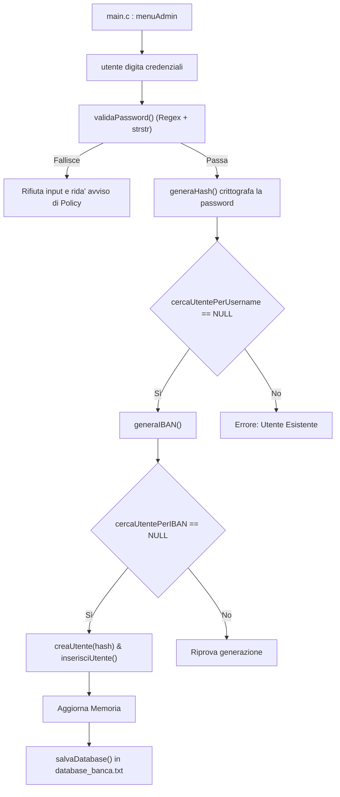
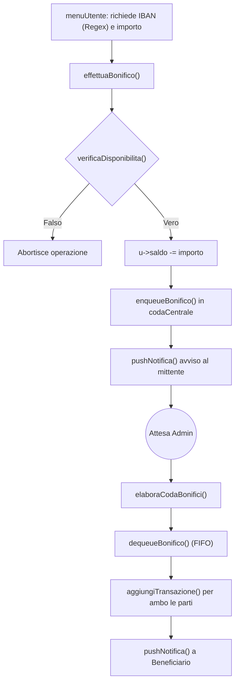
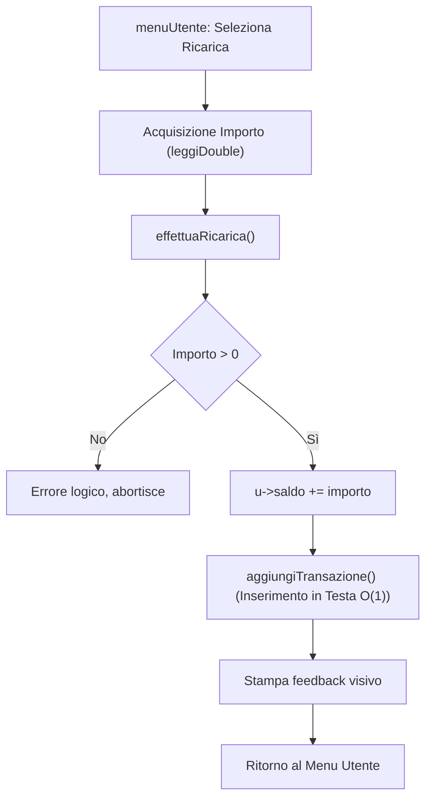
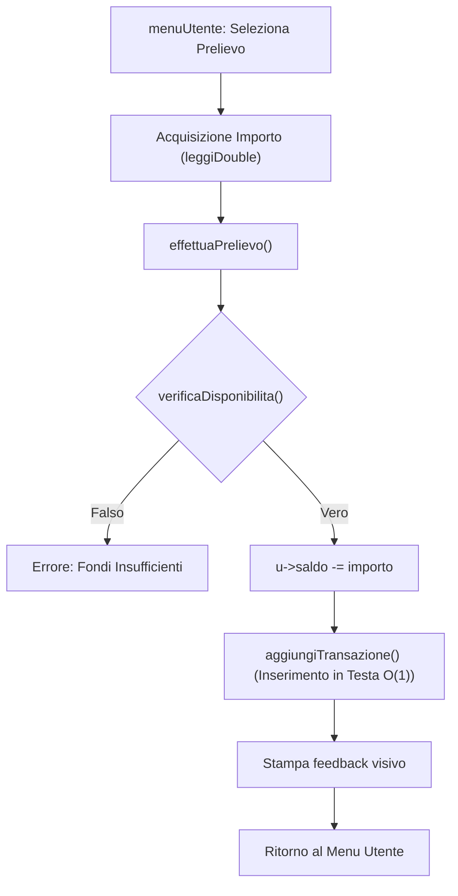
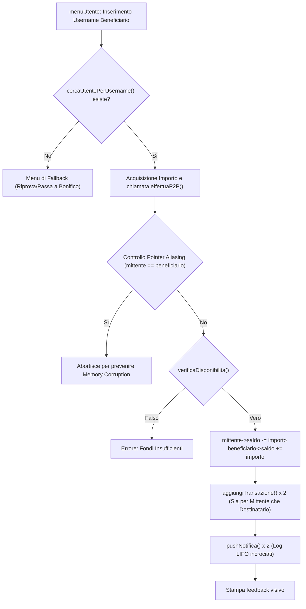
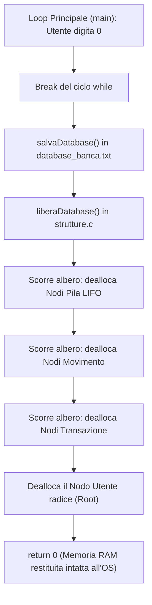

# 🏦 DATASHEET DEFINITIVO - SISTEMA BANCARIO AVANZATO C 🏦

**AUTORE/PROGETTO:** Gallina Giovanni Antonio / Pacenza Fortunato  
**LINGUAGGIO:** C  
**ARCHITETTURA:** Modulare (Header/Source separation)  
**PARADIGMI IMPLEMENTATI:** Strutture Dinamiche (Liste, Pila, Coda), Ricorsione, Ricerca, Ordinamento (BubbleSort ottimizzato), Filtraggio Dati, Gestione persistente dei file (Database), File Binari, Interfaccia Main

---

## 🗃️ SEZIONE 1: STRUTTURE DATI E VARIABILI 

### 🕒 1. Strutture Temporali:
*   **Timestamp:** `{int anno, mese, giorno, ora, minuto, secondo}` -> Data esatta.
*   **Data:** `{int giorno, mese, anno}` -> Rappresentazione di calendario semplificata.

### 🔗 2. Nodi e Strutture Lineari Dinamiche:
*   **Transazione:** `{Timestamp dataOraOperazione, char tipo[30], char controparte[50], double importo, struct transazione *next}`  
    *Ruolo*: Nodo della Lista Concatenata per lo storico movimenti.

*   **Movimento:** `{Data dataInizio, char descrizione[50], double importo, int giornoRipetizione, int intervalloMesi, struct movimento *next}`  
    *Ruolo*: Nodo della Lista Concatenata per entrate/uscite ricorrenti.

*   **NodoPila:** `{char messaggio[150], struct nodoPila *next}`  
    *Ruolo*: Nodo della struttura LIFO (Last-In-First-Out) per le notifiche asincrone.
    
*   **NodoCodaBonifico:** `{char mittente[50], char ibanBeneficiario[15], double importo, Data dataInserimento, struct nodoCoda *next}`  
    *Ruolo*: Nodo della struttura FIFO (First-In-First-Out) per l'elaborazione bonifici.
    
*   **CodaBonifici:** `{NodoCodaBonifico *front, NodoCodaBonifico *rear}`  
    *Ruolo*: Contenitore dei puntatori di testa e coda per accodamento.

### 🧠 3. Struttura Primaria e Variabili Globali:
*   **Utente:** `{char username[50], char password[50], char iban[15], double saldo, Transazione *storico, Movimento *programmati, PilaNotifiche notifiche, struct utente *next}`  
    *Ruolo*: Nodo master (Chiavi Primarie: username, iban). Contiene le proprie liste.
    
*   **Data dataSimulata (Globale):** Variabile di controllo dello "spazio-tempo" simulato.
  
*   **CodaBonifici codaCentrale (Globale):** Coda di sistema per la Gestione dei Bonifici.
---
## ⚙️ SEZIONE 2: MODULI E FUNZIONI IMPLEMENTATE (CON DETTAGLI ARCHITETTURALI)
### 🏗️ --- MODULO: STRUTTURE (`strutture.h` / `strutture.c`) ---
**Responsabilità:** Allocazione/Deallocazione RAM e manipolazione liste/pile/code.

*   **generaTimestamp:** Restituisce l'ora di sistema agganciata alla Data simulata.
*   **creaUtente:** Usa `malloc()` e inizializza i puntatori e il saldo a 0.
*   **inserisciUtente:** Head-Insertion (inserimento in testa, asintotica O(1)).
*   **cercaUtentePerUsername:** Funzione RICORSIVA (Divide et Impera). Ritorna il puntatore.
*   **cercaUtentePerIBAN:** Funzione RICORSIVA per il controllo dell'IBAN.
*   **aggiungiTransazione:** Head-Insertion nello storico dell'utente.
*   **aggiungiMovimentoProgrammato:** Head-Insertion nei piani ricorrenti.
*   **stampaMovimentiProgrammati:** Scorrimento con applicazione di codici Colore ANSI.
*   **eliminaMovimentoProgrammato:** Attraversamento lista con sgancio nodo e `free()`.
*   **pushNotifica:** Inserimento in cima alla Pila (LIFO).
*   **popNotifica:** Estrazione e deallocazione (`free`) del messaggio in cima alla Pila.
*   **inizializzaCoda:** Imposta front e rear a NULL.
*   **enqueueBonifico:** Inserimento rapido in coda (`rear->next = nuovo`).
*   **dequeueBonifico:** Estrazione rapida dalla testa (`front = front->next`) per l'Admin.
*   **liberaDatabase:** Scorre l'albero Utente->Transazione+Movimento+Pila e distrugge ogni nodo con `free()`. Previene memory leak.
*   **eliminaUtente:** Scorre la ListaUtenti, sgancia i puntatori prev/next e chiama la deallocazione a cascata (Transazioni, Movimenti, Notifiche) prima di eseguire la `free()` sul nodo radice.

#### 🔍 -> SOTTO-LOGICHE E DETTAGLI IMPLEMENTATIVI (`strutture.c`):
*   **`time_t rawtime` / `struct tm * timeinfo`:** Variabili della libreria `<time.h>` usate in `generaTimestamp` per estrarre ora, minuto e secondo reali dal SO.
*   **Logica di Sgancio Liste (`eliminaMovimentoProgrammato` / `eliminaUtente`):** Utilizza due puntatori (`curr` e `prec`). prec == NULL,`significa che il nodo da eliminare è la testa`, quindi si aggiorna direttamente il puntatore principale alla lista (es. `u->programmati = curr->next`).
  
### 🏦 --- MODULO: MOTORE BANCARIO (`motore_bancario.h` / `motore_bancario.c`) ---
**Responsabilità:** Calcolo matematico, alterazione saldi e gestione transazionale.

*   **verificaDisponibilita:** Clausola di Guardia per prevenire che il conto vada in rosso.
*   **effettuaRicarica:** Incrementa il saldo e chiama `aggiungiTransazione`.
*   **effettuaPrelievo:** Controlla fondi, decrementa e chiama `aggiungiTransazione`.
*   **effettuaBonifico:** Modello "Pre-Autorizzazione". Scala il saldo (blocco fondi) e prenota Bonifico chiamando `enqueueBonifico()`. Avvisa il mittente.
*   **elaboraCodaBonifici:** Chiama `dequeueBonifico()`. Trova mittente e destinatario (se interno). Accredita fondi, traccia log storico e invia notifiche asincrone.

#### 🔍 -> SOTTO-LOGICHE E DETTAGLI IMPLEMENTATIVI (`motore_bancario.c`):
*   **Pointer Aliasing P2P (`if mittente == beneficiario`):** Misura di sicurezza in `effettuaP2P`. Impedisce che il sistema processi le operazioni `+=` e `-=` sulla stessa area di memoria simultaneamente, annullando la validità del saldo.
*   **Pointer Aliasing BONIFICO(`if (strcmp(mittente->iban,ibanBeneficiario)==0)`):** Misura di sicurezza in `EffettuaBonifico`. Impedisce che il sistmea processi le operazioni `+=` e `-=` sulla stessa area di memoria simultaneamente, annullando la validità del saldo.
*   **Buffer di Log (`char log[150]`):** Stringhe temporanee pre-formattate tramite `sprintf()` utilizzate per iniettare i valori float (`%.2lf`) e le stringhe `%s` nelle code delle PilaNotifiche.

### 🔀 --- MODULO: ORDINAMENTO E FILTRI (`ordinamento.h` / `ordinamento.c`) ---
**Responsabilità:** Algoritmi di Sorting logico (Bubble Sort ottimizzato) e filtraggio data.

*   **scambiaTransazioni / scambiaUtenti:** Funzioni helper di swap dei dati.
*   **comparaTimestamp:** Verifica priorità tra date e tempi (anno, mese, ecc).
*   **ordinaStorico:** Bubble Sort pre-condizionato (con 2 criteri). Ordina le transazioni dell'utente.
*   **ordinaUtenti:** Bubble Sort sulle stringhe e i double. Ordina gli utenti per saldo.
*   **filtraStoricoPerMese:** Analizza le struct e usa `strstr()` (libreria `string.h`) per decifrare l'output visivo e stampare i colori.
#### 🔍 -> SOTTO-LOGICHE E DETTAGLI IMPLEMENTATIVI (`ordinamento.c`):
*   **`bool scambiato`:** Variabile di flag usata nei Bubble Sort per uscire dal ciclo while prematuramente se l'array risulta già ordinato (Ottimizzazione Caso Migliore).
*   **Puntatore `lptr`:** Limite destro del Bubble Sort. A ogni iterazione del ciclo principale, `lptr` viene arretrato all'ultimo nodo scambiato, restringendo il campo di ricerca così da dover analizzare meno nodi.
*   **`strstr()` in `filtraStoricoPerMese`:** Sottofunzione di libreria (<string.h>) che cerca substringhe (es. "Prelievo") per dedurre se applicare ANSI_COLOR_RED o ANSI_COLOR_GREEN e "-" o "+" alla stampa su termiinale.
  
### 📈 --- MODULO: PREVISIONE (`previsione.h` / `previsione.c`) ---
**Responsabilità:** Motore asincrono per la simulazione finanziaria.

*   **giorniInMese:** Stabilisce i giorni di un mese (include calcolo anno bisestile).
*   **avanzaGiorno:** Incrementa giorno/mese/anno per far scorrere la simulazione.
*   **dataMaggioreOUguale:** Comparatore tra 2 date.
*   **generaPrevisione:** L'algoritmo per la Previsione. Clona il saldo. Avanza temporalmente nel futuro, applica l'operatore "Modulo (`%`)" tra deltaMesi e intervalloMesi per verificare la periodicità del movimento, traccia il bilancio, stampa warning collisioni e riporta esattamente dopo quanti mesi il conto andrebbe in rosso.

#### 🔍 -> SOTTO-LOGICHE E DETTAGLI IMPLEMENTATIVI (`previsione.c`):
*   **Anno Bisestile:** `((anno % 4 == 0 && anno % 100 != 0) || (anno % 400 == 0))`. L'algoritmo matematico universale usato in `giorniInMese()` per Febbraio.
*   **Operatore Modulo in `generaPrevisione`:** `(deltaMesi % m->intervalloMesi == 0)`. Calcola la differenza esatta in mesi dalla creazione della transazione e verifica se è un multiplo perfetto della periodicità del movimento (es: 1=mensile, 3=trimestrale).
*   **Clone Saldo (`double saldoVirtuale`):** Variabile isolata che permette al motore di fare simulazioni senza alterare il saldo reale.

### 💾 --- MODULO: I/O STORAGE E BINARIO (`io_file.h` / `io_file.c`) ---
**Responsabilità:** Persistenza del database in Memoria.

*   **salvaDatabase:** `fopen(.."w")`, scrive in modo sequenziale (`fprintf`) la struttura del database.
*   **caricaDatabase:** `fopen(.."r")`, legge (`fscanf`) e ricostruisce in memoria la struttura del Database. Usa puntatori a Coda (`tTail`, `mTail`) per facilitare il caricamento in coda).
   
#### 🔍 -> SOTTO-LOGICHE E DETTAGLI IMPLEMENTATIVI (`io_file.c`):
*   **`char tipoRecord[10]`:** Variabile usata in `caricaDatabase` per estrarre la label pre-formattata dalla struttura del database -> (USER, TRANS, MOV).
*   **Puntatori `tTail` e `mTail`:** Cache di memoria che ricorda l'ultimo nodo inserito nella lista. Facilitando l'inserimento in coda in fase di ricostruzione del database.
* **salvaBackupBinario:** Crea una struct (`RecordUtenteBinario`) e fa un dump totale con `fwrite(.."wb")`.
* **esploraBackupBinarioConFseek:** Usa `fseek()` e `ftell()` per calcolare il peso del file. Applica la Ricerca ad Accesso Casuale balzando all'indice target.

### 🖥️ --- MODULO: FUNZIONI di SUPPORTO (`funzioni_di_supporto.h` / `funzioni_di_supporto.c`) ---

**Responsabilità:** Primitive I/O a basso livello, Regex, Sanitizzazione e Hashing (Il "Motore" dell'Interfaccia).

* **pulisciBuffer / pulisciSchermo / attendiInvio:** Funzioni helper di base.
* **stampaIntestazione:** Formatta stringhe fisse o passate via `sprintf` tramite codici ANSI.
* **leggiStringa:** Sostituisce `scanf("%s")`. Usa `fgets()` per prevenire Buffer Overflow. Converte gli spazi in underscore `_`.
* **leggiIntero / leggiDouble:** Parsing carattere per carattere. Convertono la stringa sanitizzata usando `atoi()` e `atof()`.
* **impostaDataSimulata:** Compressione matematica (`DataGrezza`) per impedire viaggi nel passato.
* **validaIBAN (Regex):** Valida l'IBAN tramite pattern `<regex.h>`.
* **generaIBAN:** Generazione pseudocasuale tramite charset esadecimale.
* **generaHash:** Motore crittografico matematico `djb2`.
* **validaPassword:** Filtro di sicurezza per le password, con implementazione delle Policy.

#### 🔍 SOTTO-LOGICHE E DETTAGLI IMPLEMENTATIVI (`funzioni_di_supporto.c`):

* **Pattern Matching Regex (IBAN):** `regcomp(&regex, "^IT-[0-9A-F]{6}$", REG_EXTENDED)`. Stabilisce la struttura (Inizia per IT-, seguito da 6 caratteri alfanumerici esadecimali).
* **Algoritmo djb2 (`generaHash`):** Usa lo shift bit a bit (`hash << 5`) per eseguire conversioni crittografiche della password in chiaro in una stringa Hash esadecimale.
* **Validazione Password:** Utilizza `strstr` (per assicurarsi che l'username non sia contenuto nella stringa) e Regex `^[a-zA-Z0-9]{10}$` (per imporre esattamente 10 caratteri strettamente alfanumerici).

### 🕹️ --- MODULO: MENU E FLUSSI (`interfacce.h` / `interfacce.c`) ---

**Responsabilità:** Logica di routing verso le varie sotto funzioni, Interfacce visive per il main.

* **menuUtente / sottomenuProgrammati:** Interfacce principali per l'accesso alle funzionalità dell'utente.
* **menuUtenteInRosso:** Limita l'accesso alla dashboard finché il saldo è negativo.
* **menuAdmin / sottomenuAdminUtente:** Gestione supervisione degli utenti per l'admin.
* **eseguiControlloIntegrità:** Sistema di Controllo Sicurezza contro Manomissioni sul databse e offre il Recupero dal file binario.

#### 🔍 SOTTO-LOGICHE E DETTAGLI IMPLEMENTATIVI (`interfacce.c`):

* **Controllo al Boot:** Apre il file binario, lo carica in un array temporaneo, e lo confronta nodo per nodo con i dati caricati dal TXT. Rileva manomissioni su (saldi modificati, password cambiate, account fantasma). Offre un ripristino dal file binario per rigenerare il TXT.
* **Strict Policy Loop:** Cicli `while` nei flussi di creazione e aggiornamento password che bloccano l'interfaccia e impediscono il salvataggio se la funzione `validaPassword` fallisce, notificando attivamente l'utente sulle regole infrante.

### 🧠 --- MODULO: ORCHESTRATORE (`main.c`) ---

**Responsabilità:** Punto d'ingresso, Inizializzazione dello Stato Globale, e Loop primario.

* **main:** Modulo minimalista. Instanzia `dataSimulata` e `codaCentrale`, carica il Database testuale, lancia l'Audit di sicurezza `eseguiControlloIntegrita()`, e reindirizza gli utenti loggati ai rispettivi sottomenu (`menuAdmin` o `menuUtente`) iniettando le dipendenze tramite passaggio per indirizzo (Puntatori). Assicura lo spegnimento sicuro chiamando `liberaDatabase()`.

---

## 🔄 SEZIONE 3: DIAGRAMMA LOGICO DELLE INTERAZIONI (FLUSSO DI CHIAMATE)

### 🛡️ FLUSSO A: Boot e Audit di Sicurezza (Anti-Manomissione)

1. `main.c` carica in RAM il database testuale tramite `caricaDatabase()`.
2. `main.c` innesca la sicurezza chiamando `eseguiControlloIntegrita()`.
3. Il sistema apre `backup_sicurezza.dat` e confronta Hashes, Saldi, IBAN con i dati in Memoria.
4. Se rileva discordanze, blocca l'accesso e richiede autorizzazione al ripristino.
5. In caso di OK, i dati sicuri sovrascrivono la Memoria e rigenerano il DataBase testuale.
6. Il ciclo (Login) ha inizio.

flowchart TD
    A["Avvio main()"] --> B["caricaDatabase() da TXT a RAM"]
    B --> C["eseguiControlloIntegrita()"]
    C --> D{"Confronto RAM vs backup_sicurezza.dat"}
    D -- "Discordanza Rilevata (Root o Storico)" --> E["Blocca Accesso e Segnala Manomissione"]
    E --> F{"L'Admin autorizza il ripristino?"}
    F -- "Sì (1)" --> G["Sovrascrive Memoria con Dati Binari e Rigenera TXT"]
    F -- "No (0)" --> H["Avviso di Sistema Compromesso"]
    D -- "Nessuna Anomalia" --> I["Boot Completato"]
    G --> I
    H --> I
    I --> J["Inizio Loop Schermata Login"]

### 👤 FLUSSO B: Registrazione Utente (Strict Policy, Collision Avoidance e Hashing)

1. `main.c` -> `menuAdmin` -> utente digita le credenziali in chiaro.
2. La password subisce la validazione rigida di `validaPassword()`. In caso di fallimento, l'input viene respinto.
3. Superato il test, la password viene istantaneamente passata a `generaHash()` (diventando irriconoscibile).
4. `cercaUtentePerUsername` / `cercaUtentePerIBAN` controllano le collisioni.
5. `creaUtente()` riceve l'hash crittografico e `inserisciUtente()` aggiorna la RAM.
6. `salvaDatabase()` esegue il dump dei dati sul disco.

### 💸 FLUSSO C: Bonifico Interbancario e Notifiche

1. `menuUtente` richiede l'IBAN (verificato tramite `validaIBAN` / Regex) e l'importo.
2. Invoca `motore_bancario.c` -> `effettuaBonifico()`.
3. `effettuaBonifico` chiama `verificaDisponibilita()`. (Se falso, abortisce).
4. `effettuaBonifico` sottrae importo a `u->saldo` (Pre-autorizzazione).
5. `effettuaBonifico` chiama `enqueueBonifico()` e mette i dati in `codaCentrale`.
6. `effettuaBonifico` chiama `pushNotifica()` e manda avviso al mittente.
-- (Il tempo passa, l'Amministratore agisce) --
7. `menuAdmin` preme "Elabora Coda".
8. `elaboraCodaBonifici` chiama `dequeueBonifico()` estraendo il FIFO.
9. `elaboraCodaBonifici` chiama `aggiungiTransazione()` per ambo le parti.
10. `elaboraCodaBonifici` chiama `pushNotifica()` inviando ricevuta al beneficiario.

### 📥 FLUSSO D: Ricarica Conto (Deposito)

1. `menuUtente` richiede l'importo da depositare (tramite `leggiIntero`/`Double`).
2. Invoca `motore_bancario.c` -> `effettuaRicarica()`.
3. `effettuaRicarica` controlla che l'importo sia strettamente maggiore di zero.
4. Il saldo dell'utente in RAM viene incrementato direttamente (`u->saldo += importo`).
5. `effettuaRicarica` chiama `aggiungiTransazione()` con causale "Ricarica".
6. Il nodo transazione viene inserito in testa alla lista dello storico (complessità O(1)).

### 📤 FLUSSO E: Prelievo dal Conto

1. `menuUtente` richiede l'importo da prelevare (tramite `leggiIntero`/`Double`).
2. Invoca `motore_bancario.c` -> `effettuaPrelievo()`.
3. `effettuaPrelievo` chiama la clausola di guardia `verificaDisponibilita()`.
4. Il saldo dell'utente viene decurtato in modo permanente (`u->saldo -= importo`).
5. `effettuaPrelievo` chiama `aggiungiTransazione()` con causale "Prelievo".

### 🤝 FLUSSO F: Trasferimento P2P (Peer-to-Peer Istantaneo)

1. `menuUtente` richiede l'Username del beneficiario usando `leggiStringa()`.
2. Chiama `cercaUtentePerUsername()` per verificare che il destinatario esista.
3. Se valido, acquisisce l'importo e invoca `motore_bancario.c` -> `effettuaP2P()`.
4. `effettuaP2P` esegue il controllo strutturale del Pointer Aliasing (`mittente == beneficiario`). Se gli indirizzi di memoria coincidono, abortisce.
5. `effettuaP2P` chiama `verificaDisponibilita()`. (Se falso, abortisce l'invio).
6. I saldi vengono aggiornati simultaneamente in RAM.
7. `effettuaP2P` chiama `aggiungiTransazione()` due volte (Storico mittente e destinatario).
8. `effettuaP2P` chiama `pushNotifica()` due volte spingendo i log incrociati nelle rispettive Pile LIFO.

### 🛑 FLUSSO G: Spegnimento Sicuro

1. `main.c` -> L'utente digita "0" nel menu. Break del ciclo `while`.
2. `main.c` chiama `salvaDatabase(db, "database_banca.txt")`.
3. `main.c` chiama `liberaDatabase(db)` in `strutture.c`.
4. `liberaDatabase` scorre i nodi "Transazione", poi "Movimento", poi "NodoPila", applicando `free()` dal basso verso l'alto, distruggendo infine il nodo "Utente".
5. Sistema operativo riceve `return 0`.

---
### 🛡️ SEZIONE 4: GESTIONE MEMORIA E PARADIGMI DI SICUREZZA

* 🔒 **POINTER ALIASING:** Risolto. Se un Utente prova a inviare soldi a se stesso, il sistema rileva la coincidenza di indirizzo RAM e blocca per evitare il doppio aggiornamento simultaneo sullo stesso saldo.
* 🚧 **BUFFER OVERFLOW:** Mitigato usando `fgets()` con limite di array in `funzione_di_supporto.c`.
* 💧 **MEMORY LEAK:** Mitigato. Le funzioni `eliminaUtente` e `liberaDatabase` svuotano a cascata l'albero dei dati e chiamano le varie free
* 🧹 **INPUT SANITIZATION:** Tutte le funzioni `atoi()` e `atof()` standard sono state protette ("wrappate") da funzioni custom che leggono e analizzano gli array di caratteri preventivamente.
* 🔐 **CRITTOGRAFIA delle PASSWORD (HASHING):** L'algoritmo matematico *djb2* converte le password inserite in stringhe esadecimali. Nessuna password viene mai salvata in chiaro nei database testuali o binari.
* ⛔ **STRICT PASSWORD POLICY:** Imposizione di vincoli architetturali sulle credenziali (10 caratteri, alfanumerici, assenza username) tramite (Regex) e ricerca sottostringhe (`strstr()`).
* 🔍 **PATTERN (REGEX):** Implementazione `<regex.h>` per la validazione strutturale delle stringhe (IBAN e Struttura Password).
* 🚨 **AUDIT DI INTEGRITÀ:** Sistema di sorveglianza al Boot. La RAM viene isolata e ogni parametro utente viene confrontato con il backup binario per intercettare manomissioni.
